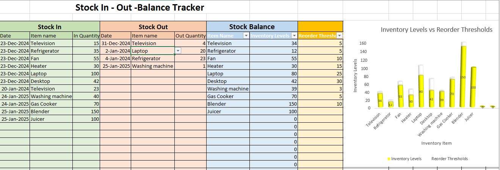

# Stock In - Out -Balance Tracker					

_A system that tracks and controls the flow of a business mechandise, ensuring timely reordering._

## Technology Used
- Microsoft Excel

## Description
This Inventory Management System is designed to help businesses efficiently track and manage their inventory levels. It provides real-time updates on stock quantities and includes a dynamic visualization that shows the remaining amount of items for each product. The system allows users to monitor inventory, track product movement, and make data-driven decisions on reordering or stock adjustments.

## Set Up/ Installation Requirements
1. Clone this repository to your desktop.
2. Navigate to the top level of the directory.
3. Open [the system](Stock-in-out-Balance-Tracker.xlsx) and input your product data with their respective quantities.
4. Monitor inventory levels through the visualizations for each item.
5. Update stock levels as items are sold or restocked.
6. Use the system’s insights to streamline inventory management and prevent stockouts.

## License
[MIT](https://opensource.org/license/MIT)

_copyright (c) 2025 **Rosemary Ojwang**_
